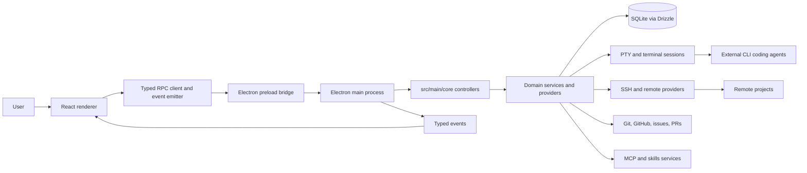

# Architecture Overview

This document is a complete architectural and conventions reference for the codebase. It describes how the application is structured, how the frontend and backend communicate, how data flows, and the standards the code follows. Reading this document together with `CLAUDE.md` is sufficient to understand the project end to end.

---

## 1. What This Application Is

A cross-platform **Electron desktop application** for orchestrating multiple AI coding agents in parallel. Each agent runs as an external command-line tool, isolated in its own Git worktree, and can execute either on the local machine or over SSH. Around that core, the app provides task and conversation management, diff review, version-control and issue-tracker integrations, interactive terminal sessions, MCP (Model Context Protocol) connectivity, a skills system, and full desktop packaging with auto-update.

The application is **provider-agnostic**: it drives whatever agent CLIs are installed (e.g. Claude Code, Codex, Gemini CLI, and others) rather than embedding a single model SDK. Agent execution happens by spawning the real CLI binary inside a pseudo-terminal.

---

## 2. Technology Stack

**Runtime & shell**
- Electron (desktop shell; main + renderer + preload processes)
- Node.js `24.14.0` (pinned via `.nvmrc`), package manager `pnpm@10.28.2`

**Backend (Electron main process)**
- TypeScript (strict)
- SQLite via **Drizzle ORM** (`drizzle-orm`, `better-sqlite3`), migrations via `drizzle-kit`
- **node-pty** for pseudo-terminal / agent process spawning
- `ssh2` for remote (SSH) execution

**Frontend (Electron renderer process)**
- **React 19** + TypeScript
- **Tailwind CSS v4** (`@tailwindcss/vite`)
- **Base UI** primitives (`@base-ui/react`) in a shadcn-style component setup (`components.json`), `lucide-react` icons
- **MobX** (`mobx-react-lite`) for domain state, **TanStack Query** (`@tanstack/react-query`) for cached server-state, plus TanStack Form / Virtual / Hotkeys
- **xterm.js** (`@xterm/xterm`) for terminal rendering
- **Monaco** (`@monaco-editor/react`) for code and diff viewing
- `react-markdown`, `react-syntax-highlighter`, `react-resizable-panels`, `react-zoom-pan-pinch`

**Build & tooling**
- **electron-vite** (dev server with HMR, production build), **electron-builder** (packaging), **electron-updater** (auto-update)
- **oxlint** (linting) and **oxfmt** (formatting)
- **Vitest** (unit, integration, and browser tests; browser tests are Playwright-backed)
- `husky` + lint-staged git hooks; a Nix flake for reproducible dev environments

---

## 3. Process & Architecture Model

Electron splits the application into three cooperating processes within a single package:

| Process | Source | Role |
|---|---|---|
| **Main** | `src/main/` | The engine. Node.js with full system access: RPC controllers, domain services, the SQLite database, PTY/terminal sessions, SSH, Git/VCS, MCP, skills. |
| **Preload** | `src/preload/index.ts` | A minimal, typed bridge that exposes a small `window.electronAPI` surface to the renderer. |
| **Renderer** | `src/renderer/` | The UI. A React application running in Chromium. |

Code and types shared across processes live in `src/shared/`. The renderer and main process communicate **in-process over Electron IPC** — there is no HTTP server and no network boundary between frontend and backend.



**Boot sequence:** the app starts at `src/main/index.ts`, which loads environment and database state, registers the RPC controllers through `src/main/rpc.ts`, creates the Electron window, and exposes the typed preload API from `src/preload/index.ts`. The renderer boots from `src/renderer/main.tsx` (mounting `App.tsx` into `index.html`), then calls typed RPC methods and subscribes to typed events.

---

## 4. Communication Layer (Typed RPC + Typed Events)

All renderer↔main communication goes through two typed primitives defined in `src/shared/lib/ipc/`. The preload bridge itself stays deliberately generic — it exposes only `invoke`, `eventSend`, `eventOn`, and `getPathForFile` on `window.electronAPI`.

### 4.1 Typed RPC (request/response)

Defined in `src/shared/lib/ipc/rpc.ts`:

- `createRPCController(handlers)` — bundles a set of operation functions into a controller (a map of named procedures).
- `createRPCNamespace(controllers)` — groups several controllers under a shared prefix, enabling nested calls like `rpc.workspace.git.commit()`.
- `createRPCRouter(routers)` — aggregates all controllers into the single application router. The exported `rpcRouter` lives in `src/main/rpc.ts`, and its type `RpcRouter` is the single source of truth for the entire callable surface.
- `registerRPCRouter(router, ipcMain)` — recursively walks the router and registers every leaf function with `ipcMain.handle` at its dot-joined channel path (e.g. `git.commit`, `workspace.git.commit`).
- `createRPCClient<RpcRouter>(invoke)` — returns a typed Proxy. Property access accumulates the channel path; calling it invokes over IPC. Every leaf is typed as `(...args) => Promise<Awaited<Ret>>`.

On the renderer side, `src/renderer/lib/ipc.ts` exports a ready-to-use, fully typed client:

```ts
export const rpc = createRPCClient<RpcRouter>(window.electronAPI.invoke);
```

Because the client is typed by `RpcRouter`, every procedure name and signature is statically known and autocompletes. Controllers live in `src/main/core/*/controller.ts` and delegate to imported operation/service functions (one operation per file is the norm).

### 4.2 Typed Events (streaming / push)

Defined in `src/shared/lib/ipc/events.ts` and exported from `src/renderer/lib/ipc.ts` as `events`. The emitter supports a topic suffix so a stream can be scoped to a specific entity (the channel becomes `${eventName}.${topic}`). This is how the main process pushes streaming data to the renderer — most notably live PTY output for a given session, plus conversation, resource, update, and host-preview events. Event payload contracts live in `src/shared/events/` (`appEvents.ts`, `githubEvents.ts`, `hostPreviewEvents.ts`, `resourceEvents.ts`, `updateEvents.ts`).

### 4.3 The full RPC namespace

The router in `src/main/rpc.ts` exposes these top-level namespaces (each backed by a controller in `src/main/core/`):

- **Core domain:** `projects`, `tasks`, `conversations`, `workspace` (namespaced into `workspace.git`, `workspace.fs`, `workspace.editor`)
- **Agent execution:** `pty`, `terminals`
- **Version control & review:** `github`, `gitlab`, `forgejo`, `pullRequests`, `repository`
- **Issue trackers:** `jira`, `linear`, `asana`, `monday`, `trello`, `plain`, `featurebase`, `issues`
- **Capabilities:** `mcp`, `skills`, `promptLibrary`, `automations`, `ssh`
- **Settings & state:** `appSettings`, `providerSettings`, `projectSettings`, `viewState`, `account`
- **System:** `dependencies`, `resourceMonitor`, `search`, `telemetry`, `update`, `app`, `legacyPort`

---

## 5. Backend — Main Process Architecture

The main process is organized by **domain** under `src/main/core/`, with each domain typically containing a `controller.ts` (its RPC surface) plus operation and service files.

**Domains present:** `account`, `agent-hooks`, `app`, `asana`, `automations`, `conversations`, `dependencies`, `editor`, `featurebase`, `forgejo`, `fs`, `git`, `github`, `gitlab`, `issues`, `jira`, `linear`, `mcp`, `monday`, `plain`, `projects`, `prompt-library`, `pty`, `pull-requests`, `repository`, `resource-monitor`, `search`, `secrets`, `settings`, `skills`, `ssh`, `tasks`, `telemetry`, `terminal-shell`, `terminals`, `trello`, `updates`, `utils`, `view-state`, `workspaces`.

**Patterns:**
- **Controller → operation delegation.** A `controller.ts` composes named operation functions (e.g. `conversations/controller.ts` aggregates `createConversation`, `getConversationsForProject`, `renameConversation`, `hydrateConversation`, and so on). Operations are small, single-purpose, and individually testable.
- **Singleton services** hold stateful concerns (e.g. PTY session registry, supervisors).
- **`Result<T, E>`** (from `src/main/lib/result.ts`) is the convention for expected/recoverable failures, rather than throwing.

Supporting main-process areas: `src/main/app/` (window, application menu, custom protocol), `src/main/db/` (database client and lifecycle), and `src/main/lib/` / `src/main/utils/` (shared helpers).

---

## 6. Data Layer

**Engine:** SQLite accessed through Drizzle ORM (`better-sqlite3`). The schema is defined in `src/main/db/schema.ts`; the database client, path resolution, and initialization live in `src/main/db/`. Migrations are generated into `drizzle/` by `drizzle-kit` (via `pnpm run db:generate`).

**Schema (tables and their roles):**

| Table | Purpose |
|---|---|
| `projects` | A tracked repository/project. Holds path, workspace provider (`local`/`ssh`), base ref, and a link to its repository workspace. The top-level entity. |
| `projectRemotes` | Git remotes per project (name + URL). |
| `projectSettings` | Per-project configuration (base and shareable settings JSON). |
| `tasks` | Units of work scoped to a project, with status, optional linked issue, workspace linkage, and type (`task` or `automation-run`). |
| `workspaces` | Execution environments: a git **worktree**, the project root, or BYOI; located locally or remotely. Tracks branch name and diff line counts. |
| `conversations` | Agent chat sessions, scoped to a project/task, persisting the provider session id for resume. |
| `messages` | Messages belonging to conversations (chat history). |
| `terminals` | Terminal session records. |
| `editorBuffers` | Editor buffer state. |
| `pullRequests`, `pullRequestUsers`, `pullRequestLabels`, `pullRequestAssignees`, `pullRequestChecks` | Pull-request tracking and associated metadata. |
| `automations`, `automationRuns` | Automation definitions and their execution runs. |
| `sshConnections` | Saved SSH connections (host, auth type, key path) referenced by remote projects/workspaces. |
| `appSettings`, `kv` | Global key/value application settings. |
| `appSecrets` | Encrypted secret storage. |

**Relationships:** `projects` is the root; `projectRemotes`, `projectSettings`, and `tasks` reference it with cascade deletes. `tasks` link to `workspaces` and `conversations`; `conversations` own `messages`. Remote `projects`/`workspaces` reference `sshConnections`.

**Versioned JSON columns:** structured JSON columns are schema-versioned. Schemas are declared in `src/shared/` via `defineVersionedSchema()` (`src/shared/lib/versioned-schema.ts`) and wired to Drizzle via `versionedJsonColumn()` (`src/main/db/versioned-column.ts`). This lets stored JSON evolve with explicit versioning.

---

## 7. Agent Execution & Terminals (PTY)

Agent execution lives under `src/main/core/pty/`. The application spawns the agent's **real CLI binary** inside a pseudo-terminal via `node-pty`, running it within a login shell in the target worktree directory (conceptually `cd <worktree> && <agent-cli> …`, e.g. resuming a session with `--resume <conversationId>`). Because it runs the genuine CLI, the agent uses the same authentication and environment as running that CLI directly in a terminal.

Notable pieces:
- `local-pty.ts` — local `node-pty` spawning.
- `ssh2-pty.ts` — PTY sessions over SSH for remote workspaces.
- `pty-env.ts` — an **allowlist** governing which environment variables pass through to spawned processes.
- `pty-spawn-platform.ts` / `spawn-utils.ts` — platform-aware command construction and shell escaping (supports wrappers such as `direnv exec` and `caffeinate` to keep the machine awake during runs).
- `pty-session-registry.ts` / `pty-session-events.ts` — tracks live sessions and emits their output as typed events (consumed by the renderer's xterm view).
- `exit-classification.ts` / `exit-signals.ts` — interpreting process exit conditions.
- `tmux-session-name.ts` — tmux session naming for relevant workflows.

The broader `terminals/` and `terminal-shell/` domains manage user-facing terminal sessions and shell selection on top of the PTY layer.

---

## 8. Frontend — Renderer Architecture

The renderer is a React 19 application that calls the engine exclusively through the typed `rpc` client and subscribes to typed `events`, both from `src/renderer/lib/ipc.ts`.

**Boot:** `src/renderer/main.tsx` mounts `App.tsx` into `src/renderer/index.html`.

**`src/renderer/app/` — application shell and registries:**
- `home-view.tsx`, `welcome.tsx`, `workspace.tsx` — top-level views.
- `view-registry.ts` — central registry of views and navigation guards.
- `modal-registry.ts` — central registry of all modals.
- `app-menu-events.tsx` — wiring for native application-menu events.

**`src/renderer/features/` — feature modules**, each owning its UI (and, where relevant, its stores and selectors): `projects`, `tasks`, `automations`, `command-palette`, `integrations`, `library`, `mcp`, `onboarding`, `settings`, `sidebar`, `skills`.

**`src/renderer/lib/` — shared renderer infrastructure:**
- `ipc.ts` — the typed `rpc` client and `events` emitter (the single entry point to the engine).
- `stores/` — MobX stores for domain state.
- `query-client.ts` + cache-invalidation helpers (`pr-cache-invalidation.ts`, `commit-history-invalidation.ts`, etc.) — TanStack Query setup and cache coordination.
- `commands/` — the command registry powering the command palette.
- `ui/`, `components/`, `layout/`, `theme/` — UI primitives, composites, layout, and theming.
- `modal/` — modal infrastructure.
- `pty/` — renderer-side PTY/terminal integration (xterm wiring).
- `monaco/`, `editor/` — code/diff editor integration and rendering.
- `providers/`, `hooks/` — React context providers and shared hooks.
- `CronPicker/`, plus small utilities (`external-url.ts`, `env-paste.ts`, `drag-files.ts`, `open-external-link.tsx`).

**State management.** Domain state lives in **MobX** stores, accessed through selectors and view hooks rather than direct field access (e.g. `getProjectStore`, `getTaskStore`, `getTaskManagerStore`, `useWorkspace`, `useConversations`, `useTerminals`). State readiness is modeled explicitly (callers check for a `ready` kind). Project selectors live in `features/projects/stores/project-selectors.ts` and task selectors in `features/tasks/stores/task-selectors.ts`. Server-derived/cached data uses **TanStack Query**.

**Registration points for new UI surfaces:** modals in `app/modal-registry.ts`, views in `app/view-registry.ts`, and commands in `lib/commands/registry.ts`.

---

## 9. Integrations & Extensibility

The codebase is built to extend along several well-defined seams:

- **Agent providers** are declared in `src/shared/agent-provider-registry.ts`. Detection of installed providers lives in `src/main/core/dependencies/dependency-manager.ts`; provider-specific PTY behavior and env passthrough in `src/main/core/pty/`; and provider output classifiers in `src/main/core/agent-hooks/classifiers/`.
- **MCP (Model Context Protocol).** Canonical MCP types live in `src/shared/mcp/`; the service is `src/main/core/mcp/services/McpService.ts` with helpers in `src/main/core/mcp/utils/`; the UI is `src/renderer/features/mcp/`. Provider-specific formats are adapted at the edges from the canonical shared types.
- **Skills.** Types and validation in `src/shared/skills/`; service in `src/main/core/skills/`; UI in `src/renderer/features/skills/`.
- **Issue trackers and Git hosts.** Each integration (Jira, Linear, Asana, Monday, Trello, Plain, Featurebase; GitHub, GitLab, Forgejo) is a self-contained domain under `src/main/core/` with its own controller, surfaced in the renderer under `features/integrations/`.

---

## 10. Configuration

- **Path aliases** (defined in `tsconfig.json`, mirrored in `electron.vite.config.ts`): `@/*` → `src`, `@renderer/*`, `@main/*`, `@shared/*`, `@root/*`.
- **`.emdash.json`** supplies per-worktree runtime settings: `preservePatterns`, `scripts.setup`, `scripts.run`, `scripts.teardown`, and `shellSetup`.
- **DB-backed project settings** (not in `.emdash.json`): `worktreeDirectory`, `defaultBranch`, `baseRemote`, `pushRemote`, `tmux`, and `workspaceProvider`.
- **Environment variables:** `TELEMETRY_ENABLED`, `EMDASH_DB_FILE`, `EMDASH_DISABLE_NATIVE_DB`, `EMDASH_DISABLE_CLONE_CACHE`, `EMDASH_DISABLE_PTY`, `CODEX_SANDBOX_MODE`, `CODEX_APPROVAL_POLICY`. Build-time telemetry uses `VITE_POSTHOG_KEY` / `VITE_POSTHOG_HOST`.
- **Runtime feature flags** are read through telemetry-backed feature-flag helpers.

---

## 11. Coding Standards & Conventions

**Environment**
- Node `24.14.0` (`.nvmrc`); `pnpm@10.28.2`. The project uses `pnpm` exclusively; `pnpm-lock.yaml` is the integrity source.

**Formatting (oxfmt, `.oxfmtrc.json`)**
- `printWidth` of 100; 2-space indentation; semicolons; single quotes in TypeScript, double quotes in JSX; LF line endings; ES5 trailing commas; sorted imports.

**Linting (oxlint, `.oxlintrc.json`)**
- Correctness errors plus TypeScript, React-hooks, and local repository rules.

**TypeScript & React**
- Strict mode, configured in the single root `tsconfig.json`.
- Avoid `any`; where a registry or boundary genuinely needs it, keep the escape local and documented.
- Use top-level `import` statements; do not use `require()`.
- Import from the original source rather than introducing re-export shortcuts.
- Components are `PascalCase`; hooks are `useX` camelCase.

**Structure conventions**
- Main-process RPC handlers live in `src/main/core/*/controller.ts` and delegate to imported operation/service functions.
- Renderer RPC calls go through `rpc` from `src/renderer/lib/ipc.ts`; streaming uses the typed `events` emitter.
- Feature UI lives under `src/renderer/features/<feature>/`; shared renderer primitives, stores, hooks, modal infrastructure, PTY, Monaco, and UI live under `src/renderer/lib/`.

**Commits**
- Conventional Commits: `<type>(<scope>): <short imperative summary>` (e.g. `fix(opencode): change initialPromptFlag from -p to --prompt for TUI`).

---

## 12. Testing

Tests run on **Vitest**, organized into projects:

| Vitest project | Scope |
|---|---|
| `node` | Unit tests for `src/**/*.test.ts`. |
| `main-db` | Main-process database integration tests. |
| `migrations` | Migration tests (`pnpm run test:migrations`). |
| `fixtures` | Fixture generation (`pnpm run db:fixtures`). |
| `browser` | Renderer browser tests, Playwright-backed (`@vitest/browser-playwright`). |

- Main-process tests are colocated as `src/main/core/**/*.test.ts`.
- Renderer unit tests live under `src/renderer/tests/`; browser tests under `src/renderer/tests/browser/`.
- Integration-style tests create temporary repositories and worktrees in `os.tmpdir()`.
- Test files use `*.test.ts` / `*.test.tsx`.

**Local merge gate:** `pnpm run format`, `pnpm run lint`, `pnpm run typecheck`, `pnpm run test`. CI (`.github/workflows/code-consistency-check.yml`) enforces `format:check`, `typecheck`, and `lint`.

---

## 13. Build, Packaging & Release

- **Dev:** `pnpm run dev` (electron-vite, renderer HMR on port 3000). `dev:main` / `dev:renderer` watch a single process; `dev:debug` raises log verbosity.
- **Build:** `pnpm run build` (`build:main` / `build:renderer` for a single target).
- **Package:** `pnpm run package` and the platform variants `package:mac`, `package:linux`, `package:win` (electron-builder; config in `electron-builder.config.ts`, with a canary config).
- **Auto-update:** handled via `electron-updater`; release workflows live in `.github/`.
- **Native modules:** `better-sqlite3` and `node-pty` are native and are rebuilt against Electron via `pnpm run rebuild`; pnpm's `onlyBuiltDependencies` lists the native packages allowed to run build scripts.
- **Dev environment:** a Nix flake (`flake.nix`) provides a reproducible toolchain.

---

## 14. Security Model

- **Secret storage.** Application secrets are stored through an encrypted app-secret service backed by Electron `safeStorage` (persisted in the `appSecrets` table). SSH credentials are handled by SSH services using OS-backed storage.
- **PTY environment.** Environment passthrough to spawned agent processes is governed by an explicit allowlist in `src/main/core/pty/pty-env.ts`.
- **Shell safety.** Command construction for local and SSH PTYs goes through dedicated shell-escaping and path-safety helpers (`spawn-utils.ts`, `pty-spawn-platform.ts`).
- **Log redaction.** File logging redacts common secret patterns.
- **Telemetry.** Optional and user-disable-able (`TELEMETRY_ENABLED=false` or in app settings); PostHog keys are supplied at build time and via CI secrets.
- **License.** Apache-2.0 (`LICENSE.md`).

---

## 15. Repository Map

```
.
├── src/
│   ├── main/            # Electron main process (the engine)
│   │   ├── index.ts     # Boot entry
│   │   ├── rpc.ts       # Aggregated RPC router (RpcRouter)
│   │   ├── app/         # Window, menu, protocol
│   │   ├── core/        # Domain modules (controllers + operations + services)
│   │   ├── db/          # Drizzle client, schema, versioned columns
│   │   ├── lib/         # Shared main helpers (incl. Result<T,E>)
│   │   └── utils/
│   ├── preload/
│   │   └── index.ts     # Minimal typed bridge (window.electronAPI)
│   ├── renderer/        # React application (the UI)
│   │   ├── index.html
│   │   ├── main.tsx     # Boot entry
│   │   ├── App.tsx
│   │   ├── app/         # Shell + view/modal registries
│   │   ├── features/    # Feature modules
│   │   └── lib/         # ipc client, stores, ui, pty, monaco, commands, …
│   ├── shared/          # Cross-process: ipc primitives, events, mcp, skills, types, versioned schemas
│   └── types/           # Ambient TypeScript declarations
├── drizzle/             # Generated SQL migrations + metadata
├── agents/              # In-repo documentation
├── build/               # Packaging assets (icons, entitlements, signing)
├── scripts/             # Release/build support scripts
├── tooling/             # Non-bundled dev/test infrastructure
├── electron.vite.config.ts
├── electron-builder.config.ts
├── drizzle.config.ts
├── tsconfig.json
├── .oxlintrc.json / .oxfmtrc.json
├── flake.nix
└── package.json         # Single root package (pnpm workspace declares only ".")
```

**Packaging note:** the repository is a single `pnpm` package (the workspace declares only the root). Frontend and backend are directories within that one package, compiled together by a single `electron-vite` configuration; there is no separately deployed service.
